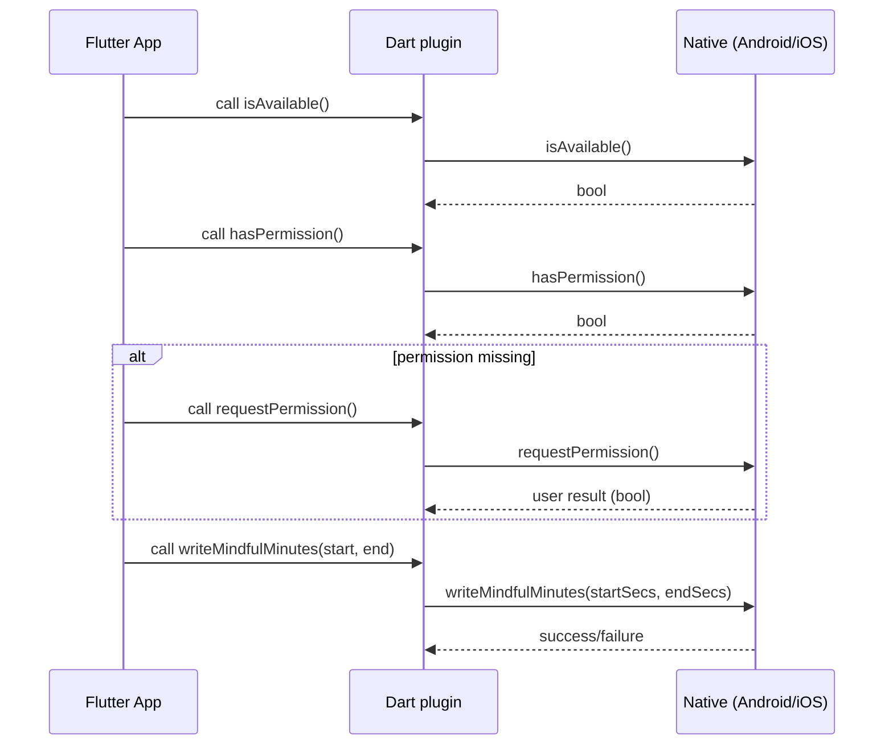

TL;DR: A small Flutter plugin to write "mindful minutes" (mindfulness/meditation sessions) to platform health APIs (Android Health Connect and iOS HealthKit).

# Flutter Mindful Minutes

**Flutter Mindful Minutes** is a Flutter plugin that lets apps record mindfulness/meditation sessions (commonly called *mindful minutes*) into the platform's health services: **Android Health Connect** and **iOS HealthKit**.

---

## Table of contents

- **Overview**
- **Supported platforms**
- **Quick install**
- **Platform setup** (Android / iOS)
- **API reference (summary)**
- **Example**
- **Architecture & Pigeon**
- **Behavior & edge cases**
- **Troubleshooting**
- **Contributing**
- **CHANGELOG**

---

## Overview

This plugin exposes a thin Dart API that delegates to platform-specific implementations to:

- Check if the platform supports writing mindful minutes.
- Check whether the app already has permission to write mindful minutes.
- Request permission from the user.
- Write a mindful session (start/end timestamps) into the platform's health store.

The plugin uses Pigeon to generate a typed, null-safe host API that the Dart layer calls into. The host implementations are in:

- Android: `android/src/main/kotlin/dev/adampalinkas/flutter_mindful_minutes/FlutterMindfulMinutesPlugin.kt` (uses Health Connect SDK)
- iOS: `ios/Classes/FlutterMindfulMinutesPlugin.swift` (uses HealthKit)

### Why use this plugin

- Keeps a consistent cross-platform **Dart API** for working with mindful minutes.
- Handles platform permission flows and writes in a small, testable surface area.
- Uses modern APIs: Android Health Connect and iOS HealthKit.

---

## Supported platforms

- Android (via Health Connect) — requires the Health Connect provider on device and an activity that can register Activity Result callbacks (see Android setup).
- iOS (via HealthKit) — requires HealthKit to be available and the appropriate entitlements and Info.plist usage descriptions.

---

## Quick install

1. Add to your `pubspec.yaml`:

```yaml
dependencies:
  
  flutter_mindful_minutes:
    git:
      url: git@github.com:dropout/flutter_mindful_minutes.git

```

2. Run:

```bash
flutter pub get
```

3. Follow platform setup below (Health Connect for Android, HealthKit for iOS).

---

## Platform setup

### Android

1. Add the required permission and activity alias to your `AndroidManifest.xml`:

```xml
<manifest xmlns:android="http://schemas.android.com/apk/res/android">

    <!-- Permission to write mindfulness sessions (Health Connect / platform-controlled) -->
    <uses-permission android:name="android.permission.health.WRITE_MINDFULNESS" />

    <application
        android:label="com.example.app"
        android:icon="@mipmap/ic_launcher">

        <!-- Your main launcher activity. Use a FlutterFragmentActivity in order for the plugin to register an ActivityResultLauncher -->
        <activity
            android:name=".MainActivity"
            android:exported="true"
            >
            <intent-filter>
                <action android:name="android.intent.action.MAIN"/>
                <category android:name="android.intent.category.LAUNCHER"/>
            </intent-filter>
        </activity>

        <!-- Activity alias used by the Health permissions UI flow (example usage) -->
        <activity-alias
            android:name="ViewPermissionUsageActivity"
            android:exported="true"
            android:targetActivity=".MainActivity"
            android:permission="android.permission.START_VIEW_PERMISSION_USAGE">
            <intent-filter>
                <action android:name="android.intent.action.VIEW_PERMISSION_USAGE" />
                <category android:name="android.intent.category.HEALTH_PERMISSIONS" />
            </intent-filter>
        </activity-alias>

    </application>

    <!-- Used to query the Health Connect provider app and related activities -->
    <queries>
        <package android:name="com.google.android.apps.healthdata" />
        <intent>
            <action android:name="android.intent.action.PROCESS_TEXT"/>
            <data android:mimeType="text/plain"/>
        </intent>
    </queries>
</manifest>
```


2. Make Sure you app's `MainActivity` extends `FlutterFragmentActivity`.

The plugin uses **Health Connect** and the Android code registers an `ActivityResultLauncher` in the host activity. To make that work reliably, your `MainActivity` should extend `FlutterFragmentActivity` (not `FlutterActivity`) so `registerForActivityResult` can be used to handle permission dialog's result.

Example (Kotlin) - `android/app/src/main/kotlin/.../MainActivity.kt`:

```
package com.example.app

import io.flutter.embedding.android.FlutterFragmentActivity

class MainActivity: FlutterFragmentActivity() {
}
```

- Ensure your app depends on the Google Play services / Health Connect provider described in the Health Connect docs. The plugin checks Health Connect availability and will return `false` from `isAvailable()` if the provider or SDK is not available or needs an update.

- The plugin requests write permission for `MindfulnessSessionRecord` through Health Connect's `PermissionController`.

Notes & tips:
- If `isAvailable()` returns `false` on a device where you expect Health Connect to be available, ensure the Health Connect provider app is installed/updated and that Google Play Services are up-to-date.
- On some OEM devices Health Connect features may be missing or behind OS version checks.

### iOS

The iOS implementation uses **HealthKit**. To get this running:

1. Enable HealthKit capability in your Xcode project (in Xcode: your target -> Signing & Capabilities -> + Capability -> HealthKit).

2. Add the HealthKit usage descriptions to your `Info.plist` (these keys are required by iOS for authorization dialogues):

- `NSHealthShareUsageDescription` — describe why your app needs to write mindful minutes (share data).
- `NSHealthUpdateUsageDescription` — describe why your app needs to update health data.

Example Info.plist snippet (replace the messages):

```xml
<key>NSHealthShareUsageDescription</key>
<string>We record your mindful/meditation sessions to your Health data so you can track progress.</string>
<key>NSHealthUpdateUsageDescription</key>
<string>We update your mindful minutes to reflect sessions you log from the app.</string>
```

3. HealthKit is not available on iPad simulators or some devices—`isAvailable()` will return false when HealthKit is unavailable.

Always test on a real device or supported simulator when working with HealthKit. If you see `isAvailable()` returning `false`, confirm you're testing on a supported platform and that the HealthKit capability and Info.plist entries are correctly set.

---

## API reference (summary)

The plugin exposes a single class from Dart: `FlutterMindfulMinutes` (see `lib/flutter_mindful_minutes.dart`).

TL;DR: All timestamps are passed in *seconds* (Unix epoch seconds).

Public API (Dart):

- `Future<bool> isAvailable()`
  - Returns `true` if the platform's health API and mindfulness session record type are supported and available.

- `Future<bool> hasPermission()`
  - Returns `true` if the app already has permission to write mindful minutes.

- `Future<bool> requestPermission()`
  - Shows the platform permission UI where relevant and returns `true` if permission was granted.

- `Future<void> writeMindfulMinutes(DateTime startTime, DateTime endTime)`
  - Writes a mindful session for the provided start and end time. The plugin converts `DateTime` values to seconds and sends them to the platform layer.

Examples (Dart):

```dart
void main() async {
  final plugin = FlutterMindfulMinutes();

  final available = await plugin.isAvailable();
  if (!available) return; // platform does not support mindful minutes

  final hasPermission = await plugin.hasPermission();
  if (!hasPermission) {
    final granted = await plugin.requestPermission();
    if (!granted) return; // user declined
  }

  final now = DateTime.now();
  await plugin.writeMindfulMinutes(now.subtract(Duration(minutes: 20)), now);
}
```

---

## Example app

A minimal example app is included under `example/` that demonstrates the common flow: check availability, request permission, and write mindful minutes. Look at `example/lib/main.dart`.

---

## Architecture & Pigeon

- The Pigeon definition is in `pigeons/flutter_mindful_minutes_pigeon.dart`. Pigeon generates `lib/flutter_mindful_minutes.g.dart` (Dart side) and platform stubs for Kotlin and Swift.

- The Dart API (`lib/flutter_mindful_minutes.dart`) uses the generated host API `FlutterMindfulMinutesHostApi` to call into the native code.

Mermaid sequence diagram (permission + write flow):



---

## Behavior & edge cases

- Time units: The plugin sends times as *seconds since epoch* to native. The Dart wrapper converts `DateTime` (milliseconds) -> seconds by dividing by 1000 and calling `.toInt()`.

- On **Android**, `isAvailable()` performs several checks:
  - Health Connect SDK availability
  - Mindfulness session feature support by the provider
  - The attached activity being a `FlutterFragmentActivity` (to support permission flow)

  If any of those checks fail the plugin returns `false` and logs a helpful message.

- On **iOS**, `isAvailable()` checks `HKHealthStore.isHealthDataAvailable()`.

- The plugin currently records a `title` of "Meditation" (Android) and uses a category HK sample on iOS. If you want localized/custom titles, consider contributing a PR to expose a title parameter.

- Permission flows are platform-native. The plugin returns `false`/throws when the permission flow cannot be completed or is denied.

---

## Troubleshooting

- iOS: If HealthKit dialogs never appear or you receive errors, confirm the HealthKit capability and `Info.plist` keys are set.
- Android: If `requestPermission()` fails with launcher not initialized, ensure `MainActivity` extends `FlutterFragmentActivity` so the plugin can register an `ActivityResultLauncher`.
- If `isAvailable()` returns `false`, verify the device has the Health Connect provider installed/updated (Android) or that the device supports HealthKit (iOS).

---

## Identified implementation notes / maintenance suggestions

- **Magic strings / numbers**:
  - Android: `title = "Meditation"` is hard-coded. Consider exposing a parameter or constant for localization.
  - Both platforms: the plugin passes `mindfulnessSessionType` / category `value = 0` — document this mapping or expose as an option.

- **MainActivity requirement (Android)**: The plugin currently requires `FlutterFragmentActivity`. Consider adding a safer fallback or documenting how to wire a manual `ActivityResultLauncher` if users need to keep `FlutterActivity`.

- **Pigeon contract**: Keep `pigeons/flutter_mindful_minutes_pigeon.dart` in sync with generated files. Regenerate when changing method signatures.

---

## Contributing

Thanks for thinking about contributing! A short guide:

1. Fork the repo and create a branch.
2. Add tests where applicable. The repository contains a `test/` folder—follow the project's existing test patterns.
3. Update `pigeons/*.dart` and regenerate platform bindings if you change the Pigeon API.
4. Open a PR describing your change and why it helps.

Please follow the Flutter & Dart style guidelines and keep API changes backward compatible when possible.

---

### Setup verification checklist

Use this checklist to verify your app and environment are configured correctly for both Android and iOS.

Android

- [ ] MainActivity extends `FlutterFragmentActivity` (not `FlutterActivity`) so the plugin can register `ActivityResultLauncher`.
  - Check `android/app/src/main/kotlin/.../MainActivity.kt` or `MainActivity.java`.
- [ ] `AndroidManifest.xml` includes the `uses-permission` for `android.permission.health.WRITE_MINDFULNESS` (or the appropriate health permission for your SDK level).
- [ ] Add the `activity-alias` and `queries` entries if you rely on the example permission flow or if Health Connect permission requests fail to appear.
- [ ] Install or update the Health Connect provider app on the test device (Google's Health Connect provider package: `com.google.android.apps.healthdata`).
- [ ] Run the example app on a physical Android device with Health Connect installed and perform the flow:
  - Launch the example app.
  - Tap the button that calls `isAvailable()` — expect `true` for supported devices.
  - If not available, inspect logs for SDK/provider messages.
  - Call `requestPermission()` and confirm the platform permission UI appears; accept and verify `hasPermission()` returns `true`.
  - Call `writeMindfulMinutes(...)` and verify the native Health app shows the newly inserted session.

iOS

- [ ] Add HealthKit capability in Xcode (Target → Signing & Capabilities → + Capability → HealthKit).
- [ ] Add `NSHealthShareUsageDescription` and `NSHealthUpdateUsageDescription` to `Info.plist` with concise user-facing reasons.
- [ ] Test on a device or supported simulator where HealthKit is available (note: some simulators or iPad simulators may not support HealthKit).
- [ ] Run the example app and perform the flow (same steps as Android): check `isAvailable()`, request permission, then write a session and confirm it appears in Health.

Cross-platform / developer checks

- [ ] Ensure you rebuilt the app after changing manifest or Info.plist entries (`flutter clean && flutter run` recommended when troubleshooting).
- [ ] Use the example app's flows as smoke tests — they exercise the permission and write paths end-to-end.
- [ ] Inspect platform logs for failures:
  - Android logcat: `adb logcat -s FlutterMindfulMinutesPlugin HealthConnect` (or open Android Studio Logcat)
  - iOS logs: view device logs in Xcode while running the app.

If any step fails, consult the Troubleshooting section above and the platform-specific Health Connect / HealthKit documentation.
